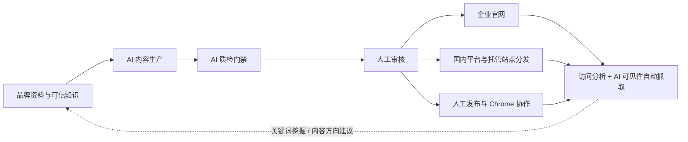
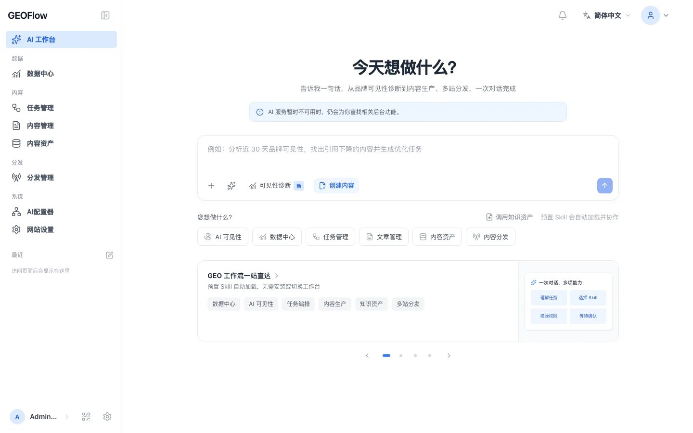
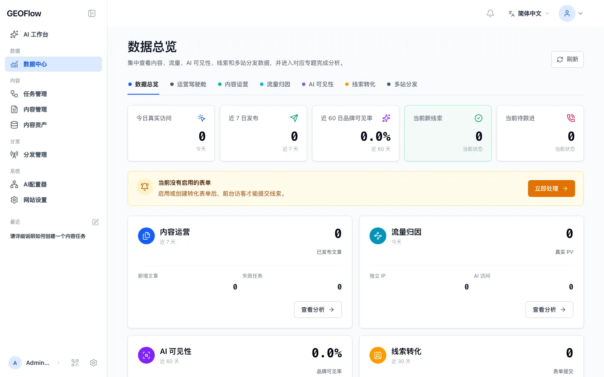
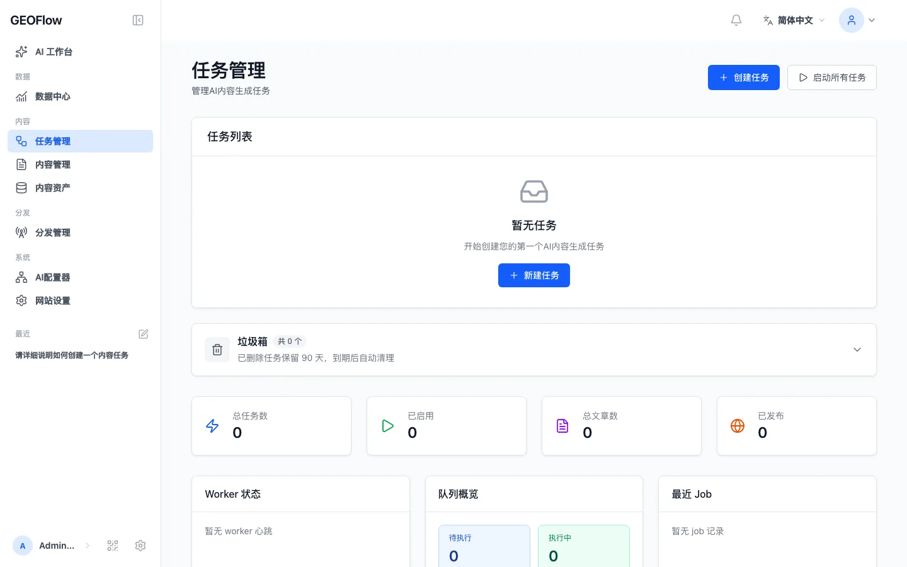
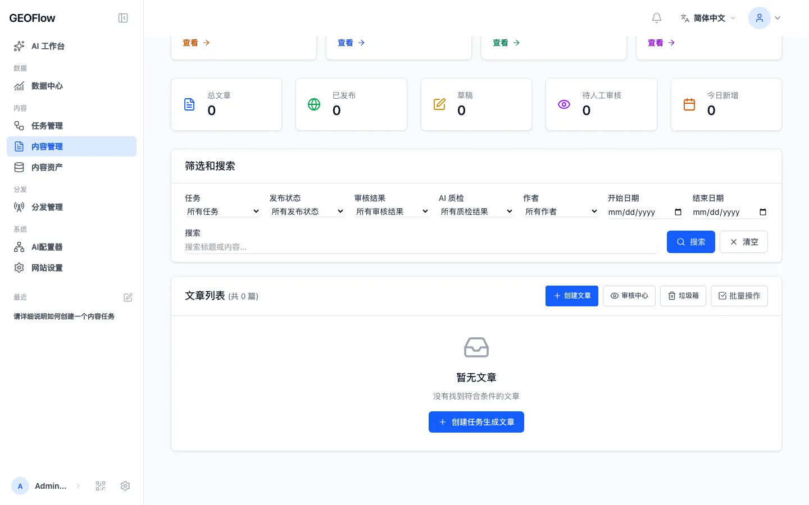
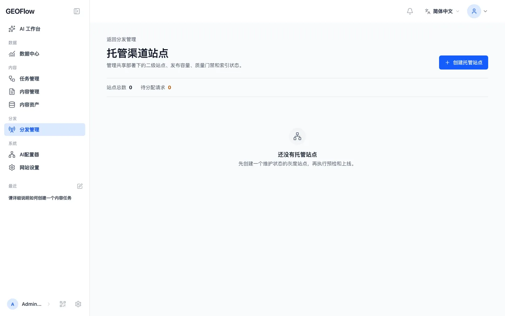
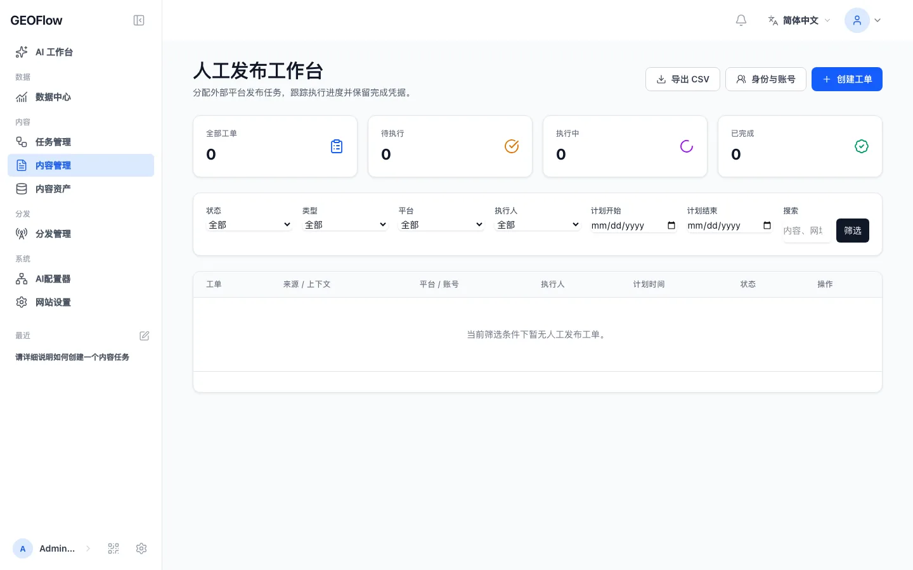

# GEOWorkFlow

> 面向企业 GEO 全链路闭环的一体化运营平台 —— 品牌知识、AI 内容生产、质量门禁、多平台分发、可见性追踪与效果复盘，全部收进同一套后台。

> Languages: [简体中文](README.md) | [English](docs/readme/README_en.md) | [日本語](docs/readme/README_ja.md) | [Español](docs/readme/README_es.md) | [Русский](docs/readme/README_ru.md) | [Português (BR)](docs/readme/README_pt_BR.md)

> **本仓库说明：** GEOWorkFlow 是基于开源 [GEOFlow](https://github.com/yaojingang/GEOFlow) 的运营定制分支，由 **mryeehee** 维护（本分支全部增量能力署名 mryeehee）。GEOFlow 原始设计与代码版权归上游作者 **yaojingang** 及 GEOFlow 项目所有，本分支遵循原项目 **AGPL-3.0** 协议。
>
> **本分支的主要增量能力（署名 mryeehee）：**
>
> | 模块              | 能力                                                                          |
> | --------------- | --------------------------------------------------------------------------- |
> | 品牌资料中心          | 后台集中配置品牌名称、品牌关键词、业务范围与内容资产，作为全部 GEO 链路的统一输入                                 |
> | AI 引用信源库        | 主流 AI 工具高频引用信源预设 × 覆盖状态透视，未覆盖信源一键预填创建分发渠道                               |
> | GEO 标准文章结构      | 生成链路注入 AI 友好引用格式（结论前置、可核验数据、FAQ、来源标注），提升被索引与引用概率                            |
> | AI 可见性自动抓取      | 定时任务按品牌关键词自动采集可见率、排名、情感与信源偏好，后台直接复盘 GEO 效果                                  |
> | 热门关键词挖掘         | 定期抓取 AI 引用热门长尾词，深度分析打分（意图 + 切入角度），一键入库关键词库                                  |
> | 内容方向建议          | 融合引用缺口、信源缺口与热门词，每周自动生成最新选题方向，闭环"方向→生成→发布→回溯→迭代"                             |
> | 国内平台分发          | 知乎、微博、小红书、百家号、搜狐、新浪、CSDN、哔哩哔哩、豆瓣、头条号 10 个平台预设 × 3 种授权模式（API / 浏览器连接 / 手动辅助），与任务管理全链路打通 |
> | AI 配置器简洁流程      | 总览页必需配置完整引导与状态清单；模型预设一键填充，点选服务商即显示对应 API Key 申请直达入口（OpenAI、Gemini、DeepSeek、智谱、火山方舟、MiniMax） |
> | 后台 Apple HIG 重构 | 运营驾驶舱独立模块、113 页 shell 全量重构（systemBlue 单一强调色、统一圆角/阴影/暗色模式、侧栏单滚动区与可拖宽），7 语言全覆盖 |
> | 品牌与更新链路         | 显示名、仓库地址、部署脚本与 CI 门禁统一指向本仓库；Updater 更新源（version.json）与 Release 资产同步发布          |

---

## GEOWorkFlow 解决什么问题

企业开展 GEO（Generative Engine Optimization，生成式引擎优化）运营时，通常需要同时管理品牌知识、AI 模型、内容生产、质量审核、官网工程、渠道发布和效果分析。工具分散会让资料来源、审核结论和发布结果难以追踪。

GEOWorkFlow 把这些工作放进同一个管理后台：



系统保留知识来源、任务配置、模型调用、质检证据、人工放行、发布状态和渠道日志；在 GEO 链路上，再以"AI 是否引用了你"为核心指标闭环迭代，让品牌、增长和内容团队的每一轮动作都可以复盘。

---

## 界面预览

<table>  
  <tr>  
    <td width="50%">   <sub>图文帮助工作台</sub></td>  
    <td width="50%">   <sub>数据中心</sub></td>  
  </tr>  
  <tr>  
    <td width="50%">   <sub>任务管理</sub></td>  
    <td width="50%">   <sub>文章 AI 质检</sub></td>  
  </tr>  
  <tr>  
    <td width="50%">   <sub>托管渠道站点</sub></td>  
    <td width="50%">   <sub>人工发布工作台</sub></td>  
  </tr>  
</table>

这些脱敏界面来自内置帮助素材，覆盖知识问答、任务调度、文章质检、托管站点、人工发布和数据分析等主要流程。

---

## 核心能力

| 能力         | 工作方式                                                                                                                     |
| ---------- | ------------------------------------------------------------------------------------------------------------------------ |
| GEO 闭环运营   | 品牌资料中心统一输入，AI 引用信源库透视覆盖缺口，可见性定时自动抓取，热门关键词挖掘入库，内容方向建议每周生成选题，形成"方向→生成→发布→回溯→迭代"完整闭环                          |
| 可信知识与内容生产  | 集中管理知识库、标题库、关键词库、图片库、作者、提示词和 AI 模型；知识库支持结构化切片、可选语义规划、向量召回和稳定回退                                                    |
| 简洁 AI 配置   | 后台 AI 配置器提供必需配置完整引导与状态清单；服务商预设一键填充，并直达各平台 API Key 申请入口                                                                  |
| AI 质量门禁    | 按知识证据、数据与引文、广告规则和发布语境检查文章，记录分项评分、原文定位、法规依据、修改建议和历史结果；待复核、阻断、异常或过期的文章停留在草稿阶段                                           |
| 审核与运营协作    | 统一管理草稿、审核、发布、回收站和批量 Markdown 导出；人工发布工作台保存身份、账号、执行人、计划时间、风险提示、回执和审计记录                                                  |
| 国内平台与多站点交付 | 知乎、微博、小红书、百家号、搜狐、新浪、CSDN、哔哩哔哩、豆瓣、头条号 10 平台预设 × 3 种授权模式；本地前台提供 SEO 元信息、Open Graph、Schema、`robots.txt`、sitemap 和 `llms.txt`；渠道支持托管站点、GEOFlow Agent、WordPress REST 和通用 HTTP API |
| 数据反馈与日常运维  | 数据中心汇总内容、分发、访问、Top 内容、AI 爬虫和趋势；独立 Updater 负责签名更新、完整备份、环境验收和恢复点回滚，更新源指向本仓库 Release 的 `version.json`                        |
| 团队与开发者入口   | 后台 v3 外壳按 Apple HIG 重构（运营驾驶舱、可折叠可拖宽侧栏、暗色模式）、七语言、响应式布局、PWA 和图文帮助；API v1、CLI 与内置 Agent Skill 覆盖自动化与二次开发                     |

部署并完成基础站点设置后，主站和托管站会自动提供 `/robots.txt`、`/sitemap.xml`、`/sitemap.txt` 和 `/llms.txt`。这些地址按当前站点、发布状态、索引开关、规范化文章链接和站点设置实时生成。`robots.txt` 会自动限制后台、API、运行时调试、上传存储、搜索参数和图片文件的抓取；这些规则只管理爬虫访问意向，敏感数据仍须使用认证、授权和服务器访问控制保护。

---

## 适用场景

| 场景          | 建议用法                        | 重点能力                             |
| ----------- | --------------------------- | -------------------------------- |
| 企业官网 GEO 运营 | 围绕产品、案例、FAQ、行业知识和品牌规则持续建设内容 | 品牌资料中心、知识库、任务、质检、官网发布、可见性抓取       |
| 官网 GEO 子频道  | 通过子域名或独立目录快速建立资讯、知识或解决方案频道  | 主题、栏目、SEO、内容调度、线索表单              |
| 行业信源站       | 围绕一个行业、主题或问题域维护可核验的长期内容资产   | RAG、审核、引用友好输出、sitemap、`llms.txt` |
| 多平台内容分发     | 一套内容同时投递国内主流平台并留痕回执          | 10 平台预设、授权模式、分发日志、任务管理           |
| 内部内容运营平台    | 弱化公开前台，由品牌、增长和内容团队统一生产与审核   | 素材库、API、CLI、人工发布、权限和审计           |
| 多品牌与多站点     | 从一套后台管理多个站点、栏目或内容出口         | 托管站点、Agent、WordPress、通用 API、分发日志 |

GEOWorkFlow 适合拥有真实业务资料、明确审核责任和持续运营计划的团队。知识库质量、人工判断和长期维护决定内容能否稳定获得用户与 AI 的信任。

---

## 安全与治理

| 范围    | 设计边界                                                   |
| ----- | ------------------------------------------------------ |
| 内容质量  | 知识证据、规则版本、评分、人工放行和结果过期均可追踪                             |
| 账号与权限 | 管理入口按权限过滤，敏感操作由超级管理员控制，任务和人工发布保留状态历史                   |
| 凭据管理  | AI 模型与渠道的 API Key 加密存储，后台默认掩码显示；密钥申请入口仅为官方文档链接，不落库      |
| 浏览器协作 | Chrome 扩展使用设备配对与最小权限 Token，不保存外部平台密码、Cookie 或 OAuth 凭证 |
| 出站请求  | URL 导入、分发、AI、主题参考和更新检查经过统一安全策略，限制私网访问、重定向和响应体大小        |
| 更新与恢复 | Updater 使用签名包、本地 Unix socket、环境验收、完整备份和恢复点，高风险请求要求二次验证 |
| 匿名统计  | 默认关闭；启用后只发送固定白名单字段，业务内容、账号、邮箱、域名、Cookie 和密钥不会进入载荷      |

安全设计、部署门禁和升级步骤以 [部署文档](docs/deployment/DEPLOYMENT.md) 与当前版本发布说明为准。

---

## 快速开始

### Docker 开发与体验

```bash
git clone https://github.com/mryeehee/GEOWorkFlow.git
cd GEOWorkFlow
cp .env.example .env
docker compose build
docker compose up -d --remove-orphans
```

- 前台默认地址：`http://localhost:18080`
- 后台默认地址：`http://localhost:18080/geo_admin/login`
- 端口由 `APP_PORT` 控制，后台前缀由 `ADMIN_BASE_PATH` 控制
- 首次启动由 `init` 服务完成数据库迁移和空库安装
- 登录后进入 **AI 配置器**：按"必需配置完整引导"清单依次完成对话模型、嵌入模型与分发渠道配置，每个服务商预设都附带官方 API Key 申请直达入口

开发环境的默认管理员配置见 [部署文档](docs/deployment/DEPLOYMENT.md)。生产环境应显式设置管理员密码、HTTPS、Cookie 安全策略和反向代理配置。

### Docker 生产部署

生产环境使用 `docker-compose.prod.yml`，由 Nginx 和 php-fpm 提供 Web 服务。部署前请准备 `.env.prod`、数据库备份策略、HTTPS、持久化目录和运行进程管理：

```bash
cp .env.prod.example .env.prod

docker compose --env-file .env.prod -f docker-compose.prod.yml build
docker compose --env-file .env.prod -f docker-compose.prod.yml up -d postgres redis
docker compose --env-file .env.prod -f docker-compose.prod.yml up -d init
docker compose --env-file .env.prod -f docker-compose.prod.yml up -d --remove-orphans app web queue ai-quality-queue ai-quality-backfill-queue ai-optimization-queue knowledge-queue scheduler reverb
```

完整的生产部署、健康检查、反向代理和故障恢复说明见 [`docs/deployment/DEPLOYMENT.md`](docs/deployment/DEPLOYMENT.md)。

### 更新与发布

- 正式 Release、源码压缩包与更新元数据见 [GitHub Releases](https://github.com/mryeehee/GEOWorkFlow/releases)
- Updater 更新源：`https://github.com/mryeehee/GEOWorkFlow/releases/latest/download/version.json`
- 精确源码版本见 [`version.json`](version.json)；已有部署的升级请先执行 [停机排空与安全迁移协议](docs/deployment/DEPLOYMENT.md)，避免直接 `git pull` 后重建容器

---

## 组件与运行环境

| 组件              | 当前源码版本或状态         | 说明                                                                                          |
| --------------- | ----------------- | ------------------------------------------------------------------------------------------- |
| GEOWorkFlow Core | `3.2.0-beta.2`    | Laravel 应用、管理后台 v3、前台、API、队列、国内平台分发与 GEO 闭环模块                                            |
| 上游基线            | GEOFlow `3.2.0-beta.1` / 稳定版 `3.1.0` | 本分支在其之上叠加全部增量能力，上游见 [yaojingang/GEOFlow](https://github.com/yaojingang/GEOFlow) |
| CLI             | `0.4.0-preview.1` | 内置命令与独立 PHAR 预览版；远程草稿可用，主题发布尚未开放                                                            |
| Chrome 运营助手     | `0.1.0`           | 源码和打包产物位于 `browser-extension/` 与 `dist/browser-extension/`                                  |
| Updater         | 独立组件              | 使用与目标 Release 明确兼容的签名版本，参见 [geoflow-updater](https://github.com/yaojingang/geoflow-updater) |
| 目标站点 Agent      | 按渠道生成             | 每个渠道可生成预配置 PHP 包，提供首页、详情页、静态资源、Schema、sitemap 和 `llms.txt`                                  |

运行要求：

| 组件      | 要求                                  |
| ------- | ----------------------------------- |
| PHP     | 8.3 及以上，Docker 默认可使用 PHP 8.4        |
| 数据库     | PostgreSQL，推荐使用 pgvector 镜像或兼容扩展    |
| Redis   | 用于队列、缓存和运行状态                        |
| Node.js | 用于前端资源构建，CI 使用 Node.js 22           |
| 容器部署    | Docker Compose，生产使用 Nginx 与 php-fpm |

---

## 开发者入口

### CLI

`bin/geoflow` 通过 API v1 管理目录、任务、执行记录、素材和文章，支持安全配置、登录、JSON 文件或 stdin、删除确认和结构化错误。

[CLI 中文文档](docs/GEOFLOW_CLI.md) | [CLI English guide](docs/GEOFLOW_CLI_en.md)

### Agent Skill

仓库内置统一的 [Agent Skill](.agents/skills/geoflow/)，覆盖 Laravel 开发、后台运营、网站前台、主题模板、渠道站点和旧版迁移。支持 Agent Skills 的工具打开仓库后可以直接发现它；Codex 用户可通过 `$geoflow` 调用。

安装与回滚说明见 [Skill README](.agents/skills/geoflow/README.md)。

### 开发与测试

```bash
composer install
npm ci
npm run build
composer test
npm run test:analytics
vendor/bin/pint --test
```

贡献代码前请阅读 [贡献指南](CONTRIBUTING.md)。

---

## 开源协议与商业授权

GEOWorkFlow 分支沿用上游 GEOFlow 的 [GNU Affero General Public License v3.0](LICENSE)。此前按 Apache-2.0 发布的上游版本继续适用原许可证，历史文本保存在 [`docs/licenses/Apache-2.0.txt`](docs/licenses/Apache-2.0.txt)。

**个人和企业均可免费使用开源版，也可以用于商业用途。** 在遵守 AGPL-3.0 的前提下，下列场景无需另购商业许可；公司内部使用、为客户提供服务或对服务收费，本身都不会产生购买商业许可的要求。

| 使用场景                                               | 授权说明                                           |
| -------------------------------------------------- | ---------------------------------------------- |
| 个人学习、研究、教学、功能评估与测试                                 | 可免费使用、部署和修改                                    |
| 公司内部知识管理、内容生产、AI 质检与团队协作                           | 可免费部署供员工使用，营利性企业同样适用                           |
| 运营自己的企业官网、品牌站、GEO 子频道或行业信源站                        | 可免费使用，支持商业运营                                   |
| 代理公司、工作室或咨询团队为客户提供内容生产与代运营服务                       | 可免费使用，也可以收取内容制作、咨询和运营服务费                       |
| 为客户提供部署、培训、维护或二次开发交付                               | 可免费使用并收取服务费；交付软件副本时需履行适用的 AGPL 分发与源码提供义务       |
| 基于本软件提供托管服务或在线服务（SaaS）                       | 可免费使用并对服务收费；修改版通过网络提供服务时，需向交互用户提供完整对应源码的免费获取方式 |
| 二次开发、再分发，以及遵守 AGPL 的品牌定制或 OEM 交付                   | 可免费使用；需保留必要声明并履行适用的同许可证与源码提供义务，商标权需另行确认        |
| 需要豁免 AGPL 源码提供等义务，例如在相关义务适用时仍要求代码闭源的白标、OEM 或专有集成方案 | 向上游版权所有者申请单独的商业许可，按双方签署的协议使用                     |

使用前请留意：

- **企业内部使用也应遵守适用条款。** 如果修改后的软件供员工通过网络交互使用，应按 AGPL 第 13 条向这些用户显著提供完整对应源码的免费获取方式；对外提供修改版网络服务也适用该要求。
- **业务资料与软件源码分开判断。** 独立的知识库资料、客户数据和生成的文章，通常不会仅因使用本软件而需要按 AGPL 公开；若输出包含受许可证覆盖的程序代码或其他作品，应按具体内容判断。
- **免费指软件许可费。** 服务器、域名、模型 API 调用、第三方服务以及另行采购的技术支持费用由使用方承担。

以上是现有许可证的场景说明，不新增许可例外。具体权利和义务以 [LICENSE](LICENSE) 为准；可参阅 [AGPL 第 13 条](https://www.gnu.org/licenses/agpl-3.0.html#section13) 和 [GNU 关于程序输出的说明](https://www.gnu.org/licenses/gpl-faq.en.html#WhatCaseIsOutputGPL)。上游代码的商业授权请通过 [GEOFlow 仓库 Issue](https://github.com/yaojingang/GEOFlow/issues/new) 联系版权所有者；Issue 内容会公开显示，请勿提交合同、报价、客户资料或其他敏感信息。

外部贡献者保留其贡献版权，同时需要在合并前接受 [Contributor License Agreement v1.0](CLA.md)，使项目可以持续提供 AGPL 开源版本和单独的商业授权。

### 匿名使用统计

匿名使用统计默认关闭。部署方同时启用开关并配置 HTTPS 采集地址后，已登录后台页面每天最多发送一次活跃事件，字段限定为随机实例 ID、管理员不可逆摘要、应用版本和事件类型。

```dotenv
GEOFLOW_TELEMETRY_ENABLED=false
```

域名、页面路径、管理员账号、邮箱、文章内容、Cookie、`APP_KEY` 和业务密钥不会进入上报载荷；采集地址是否上报由部署方自行决定，本分支不新增任何默认上报。

---

## 社区与支持

- 后台侧栏提供"加入交流群"入口，内置微信群二维码
- 部署与升级问题请先阅读 [部署文档](docs/deployment/DEPLOYMENT.md) 与 [更新日志](docs/CHANGELOG.md)
- 缺陷与需求请提交 [GitHub Issues](https://github.com/mryeehee/GEOWorkFlow/issues)

---

## 多语言文档

- [English README](docs/readme/README_en.md)
- [日本語 README](docs/readme/README_ja.md)
- [Español README](docs/readme/README_es.md)
- [Русский README](docs/readme/README_ru.md)
- [Português (BR) README](docs/readme/README_pt_BR.md)

---


---

## 致谢与署名

- 上游项目与原始设计：[yaojingang/GEOFlow](https://github.com/yaojingang/GEOFlow)（AGPL-3.0）
- 本分支全部增量能力、后台重构与运营定制模块：© 2026 **Mryeehee**
